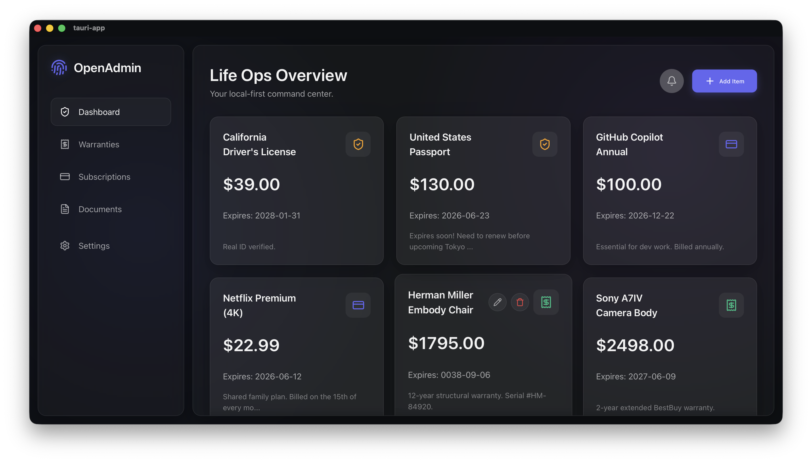

<div align="center">
  
  <h1>OpenAdmin</h1>
  <p><em>The privacy-first "Life Ops" Dashboard.</em></p>
  <br />
  
</div>

OpenAdmin is a local-first application designed to manage personal operations (warranties, subscriptions, expiring passports) without ever sending sensitive data to the cloud.

## Features
- **Receipt OCR & Warranty Tracking:** Extract purchase dates and warranty lengths locally.
- **Document Expiration Reminders:** Never let your passport or ID expire unnoticed.
- **Subscription Tracker:** Automated alerts to cancel free trials before you get billed.

## Technology Stack
Built for maximum privacy, speed, and minimal memory footprint:
- **Framework:** Tauri v2
- **Backend:** Rust + embedded SQLite
- **Frontend:** Vite + React + TypeScript
- **Styling:** Vanilla CSS (Glassmorphism design)
- **OCR:** Local Tesseract.js (WebAssembly)

## Prerequisites
To develop and build this project, you will need:
- [Node.js](https://nodejs.org/) (v18+)
- [Rust](https://www.rust-lang.org/)
- Tauri OS-specific dependencies (e.g., Xcode build tools on macOS)

## Getting Started

1. **Install Dependencies:**
   ```bash
   npm install
   ```

2. **Run Development Server:**
   This command spins up the Vite frontend and compiles the Rust backend simultaneously.
   ```bash
   npm run tauri dev
   ```

3. **Build for Production:**
   ```bash
   npm run tauri build
   ```

## Architecture Justification
We explicitly chose Tauri over Electron because it uses the native OS webview, keeping the application bundle tiny (~5MB) and idle RAM usage exceptionally low. The local embedded SQLite database ensures that your sensitive "Life Ops" data never leaves your device.
